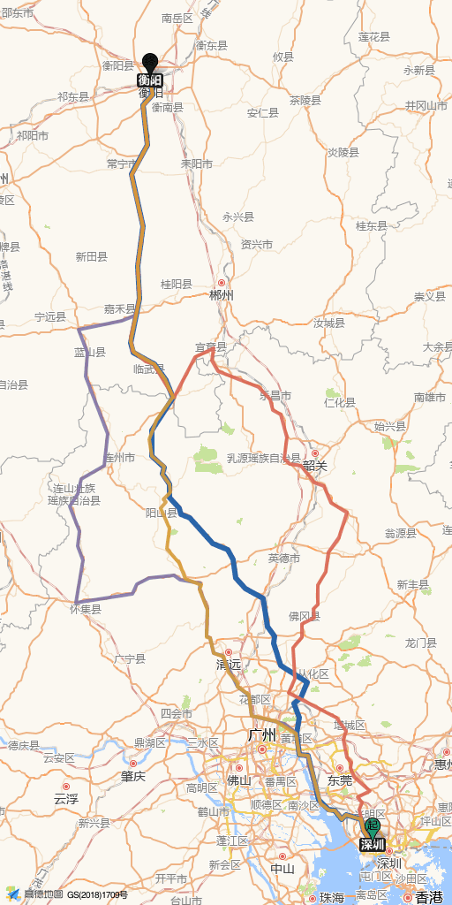

# 国庆长途路况监测 · 深圳西丽 ↔ 衡阳

一句话：**同时盯住 4 条候选走廊，记录高德当前预计耗时和分段路况，逐步积累自己的历史基线，为「哪天、几点、走哪条」提供参考。**

基础接口不会直接给出这条固定路线的个人历史基线，所以项目从启用后自行积累。
平常每 30 分钟、临近出行窗口每 15 分钟采一次。刚开始的出发窗口主要是经验推算，
覆盖更多日期和小时后才逐渐由采样主导。

---

## 一、五分钟上手

```bash
cd ~/Documents/waytohome

# 1. 装依赖
python3 -m venv .venv && .venv/bin/pip install -r requirements.txt

# 2. 填高德 Key（申请方式见第三节）
cp .env.example .env && open -e .env

# 3. 采一轮（4 条走廊 × 去返 2 个方向 = 8 次调用）
.venv/bin/python src/collect.py
.venv/bin/python src/analyze.py

# 4. 看看板
cd web && python3 -m http.server 8000
# 浏览器打开 http://localhost:8000
```

> 想看「攒了两周数据是什么样」？运行 `python3 tests/backfill_demo.py --days 14`，
> 它会用真实路线几何 + 模拟耗时造 14 天样例。**仿真数据默认不进基线**，
> 要预览效果得在 `config.yaml` 里临时设 `analysis.include_simulated: true`。
> 想清掉就 `python3 tests/backfill_demo.py --clean`。

---

## 二、4 条候选走廊

从深圳到衡阳，真正合理的走廊只有 2–4 条，所以这里设成 **1 条推荐 + 3 条备选**，
每个采集轮次全部算一遍，横向比。

| # | 走廊 | 定位 | 新版里程 | 当前预计耗时 | 过路费 | 说明 |
|---|---|---|---|---|---|---|
| 1 | **广连—许广通道**（经从化 · 黎溪 · 连州） | ★ 推荐 | 首次新版采集后显示 | 同左 | 同左 | 走中部通道，避开韶关主城区 |
| 2 | **许广高速 G0421**（清连段） | 备选 | 首次新版采集后显示 | 同左 | 同左 | 粤北西侧并行通道 |
| 3 | **京港澳 G4**（经韶关曲江） | 备选 | 首次新版采集后显示 | 同左 | 同左 | 东侧传统主通道 |
| 4 | **二广 G55**（经怀集 · 连山） | 备选 | 首次新版采集后显示 | 同左 | 同左 | 最西侧兜底通道 |

里程和耗时来自高德路径规划的当前估算，不是车辆实跑记录，会随交通和算法变化。

**为什么每条走廊都要钉途经点** —— 这是整套东西能不能用的关键：

- 高德路径规划可能调整走法。今天走广连，明天可能被带去二广，每天的采样落在
  不同路段上，「哪几段比平常更堵」就无从比较。
- 钉住之后，每天比的是同一条走廊上的同一段路。
- 去程和返程使用各自方向的**高速主线路点**。服务区 POI 分方向，反向复用同一坐标可能导致
  下高速、掉头或重复经过同一组隧道。
- 每次改途经点都要递增 `route_version`，旧路线数据会自动隔离。

**返程同样监测**，走廊集合一致、方向反过来。返程高峰（10/6–10/7）的形态和去程完全不同。

2026 年国庆期间，G4 宜章枢纽至朱亭互通南往北方向处于封闭施工期。去程中的“京港澳 G4”
实际只能比较高德当时给出的绕行方案，不能理解为全程沿 G4 北上。出发前应再次核对交通管制：
<https://jtt.hunan.gov.cn/jtt/hnjtza/zazt/jjzdxm/202603/t20260317_33935461.html>

---

## 三、申请高德 Key（约 5 分钟，免费）

1. 打开 <https://lbs.amap.com> → 右上角「注册」，用手机号注册
2. 登录后完成**个人认证**（支付宝扫码，几分钟通过）
3. 右上角进「控制台」→ 左侧「应用管理」→「我的应用」→「创建新应用」
4. 应用建好后点「添加 Key」：
   - **服务平台必须选「Web服务」**（不是 Web端 JS API，选错了会报 `INVALID_USER_SCODE`）
   - 名字随便填，比如 `route-monitor`
5. 复制生成的 Key，填进 `.env`：

```
AMAP_KEY=你复制的那串字符
```

按高德 2026 年公开定价页，符合非商业条件的个人认证开发者，基础 LBS 服务共享月配额为
15 万次，并注明自注册认证之日起享受 1 年免费月配额；最终以你的控制台为准。
本系统每轮消耗 **8 次调用**。30 分钟档约 384 次/天，15 分钟档约 768 次/天，
整月都跑密集档约 2.3 万次。价格和配额见 <https://lbs.amap.com/upgrade>。

---

## 四、部署到 GitHub Actions（推荐，电脑不用常开）

本机跑的问题是：Mac 关机就没数据了。丢到 GitHub Actions 上就不用管了。

1. 在 GitHub 新建一个**公开仓库**并把本目录推上去。GitHub Free 的私有仓库 Pages 不属于免费方案，
   而且私有仓库 Actions 有分钟数额度
2. 仓库 → **Settings → Secrets and variables → Actions → New repository secret**
   - Name 填 `AMAP_KEY`，Value 粘贴你的 Key
3. 仓库 → **Actions** 标签页 → 左侧「采集路况」→「Enable workflow」
4. 仓库 → **Settings → Pages**：Source 选 **GitHub Actions**

工作流每 15 分钟被唤醒；脚本再按 `config.yaml` 的 30/15 分钟两档判断是否调用高德。
采集、分析完成后，工作流直接发布 `web/`，不依赖机器人提交再次触发 Pages。

免费方案使用公开仓库，因此 `data/raw/` 中的起终点、路线和采样时间也会公开。
`noindex` 只能减少搜索引擎收录，不能提供访问控制。若这些数据不能公开，需要改用付费私有方案或其他带鉴权的托管方式。

**两个必须知道的事**：

- GitHub 的定时任务可能延迟，繁忙时也可能丢弃排队任务，因此这是准实时监测，不是严格的实时系统。
- 仓库**连续 60 天没有任何提交，GitHub 会自动停用定时任务**。本工作流每次跑都会提交数据，
  所以只要在跑就不会被停；但如果中途停很久，记得回仓库看一眼 Actions 页面。

工作流目前每 15 分钟唤醒一次，所以把 `interval_dense_minutes` 改到 15 分钟以下不会提高实际频率。

---

## 五、手机查看

部署成功后，直接用手机浏览器打开 GitHub Pages 地址。页面会每 5 分钟重新读取一次
`data.json`，也可以下拉刷新。需要更快打开时，把页面添加到浏览器收藏夹或手机主屏幕即可。

### iPhone 通知：Bark

使用 [Bark](https://github.com/Finb/Bark) 接收通知，不需要开发小程序，也不用让 Mac 常开。
程序通过 [Bark HTTP API](https://github.com/Finb/bark-server/blob/master/docs/API_V2.md)
发送普通通知；点击通知可以打开看板。

1. iPhone 安装 Bark，允许通知，复制 App 中的专属地址，形如 `https://api.day.app/你的设备密钥`。
2. GitHub 仓库 → **Settings → Secrets and variables → Actions → Secrets**，
   添加 `BARK_URL`，值填上述地址。也支持 App 复制的带测试标题/正文的地址，但不要带 `?` 查询参数。
3. 同一页面切到 **Variables**，添加 `DASHBOARD_URL`，值填你的 GitHub Pages HTTPS 看板地址（可选）。
4. **Actions → 测试 iPhone 推送 → Run workflow**，手动发一条消息，确认手机收到。

默认自动提醒日期为 **北京时间 2026/9/25 至 10/7 全天**，覆盖你的去返出行窗口：

| 条件 | 通知规则 |
|---|---|
| 推荐走廊预计耗时明显变化 | 比首次或上次已提醒采样增加/减少至少 30 分钟；参照最长保留 24 小时 |
| 备选路线明显更快 | 同轮高德估算比推荐走廊少至少 30 分钟；同一优势持续时只报一次 |
| 采集异常 | 连续 3 个不同采集轮次所有路线都失败，或最新采样超过 45 分钟 |
| 异常恢复 | 已报过异常后，重新取得新鲜的有效路线时提醒一次 |

同一方向的通知至少间隔 **60 分钟**。第一次成功采样建立耗时参照，不会凭空生成变化提醒；
若此时备选路线已明显更快，仍可提示。这里只比较高德**当前预计耗时**，不把经验预测的出发窗口
当成确定结论推送，也不把这个短期参照叫“平常耗时”。路线版本改变、道路序列改变或里程变化
超过 2% 时重新建立参照。旧版本、仿真数据和过期数据不触发交通变化提醒。

通知状态保存在 `data/notification-state.json`，随采样一起提交，用于跨运行去重；其中不含 Bark 密钥。
不要把 `BARK_URL` 放进 `config.yaml`、`web/` 或公开仓库。发送失败不记为已送达，下一轮重新判断；
网络超时但服务端已接收，或通知成功后状态提交失败时，仍可能出现重复通知。

未设置 `BARK_URL` 会跳过推送，不影响采集或看板。普通通知遵循 iPhone 的通知/专注模式设置。
采集异常提醒依赖工作流仍能执行；GitHub 定时任务完全停跑时，这个任务无法给自己发停机告警。

本机使用时，把 `BARK_URL` 和可选的 `DASHBOARD_URL` 添加到已有 `.env`，不要覆盖原来的 `AMAP_KEY`：

```bash
.venv/bin/python src/notify.py --test             # 发送一条测试通知
.venv/bin/python src/notify.py --test --dry-run   # 只预览测试文案，不发消息
.venv/bin/python src/notify.py --dry-run          # 预览当前是否触发，不改状态
```

本机定时运行须依次执行 `collect.py`、`analyze.py`、`notify.py`。
`collect.py --loop` 只采集，不自动分析或推送。日期与阈值都在 `config.yaml` 的 `notifications` 段调整。

---

## 六、看板怎么读

| 你的问题 | 看板上的位置 |
|---|---|
| 走哪条最快？ | 首屏「四条走廊，此刻谁最快」+ 走廊总览表的排名与差距条 |
| 几点出发？ | 「走廊 × 出发时刻」图 +「出发窗口地图」+「最佳出发窗口」表 |
| 为了避开主通道要付出多少代价？ | 「每条走廊自己的最优窗口」表 |
| 具体哪几段堵？ | 「沿线分段」的 4 走廊均速矩阵 + 实时路况色带 +「比平常更堵的断面」表 |
| 比平常堵多少？ | 分段对比表的「比平常 ±%」列 |
| 会不会赶得上高速免费？ | 窗口表里的「免费 / 收费」标记 + 热力图上的绿点 |
| 现在出发要开多久？ | 首屏大数字 |
| 这四条线到底怎么分叉、哪条更偏西？ | 「四条走廊 · 空间走向」缩略图 |

看板顶部有 `去程 / 返程` 切换。出发窗口地图还有一个**走廊切换器**：选「最快走廊」时，
每个格子显示该时刻 4 条走廊里最快的那条，鼠标悬停能看到全部 4 条各自的耗时。

### 四条走廊的空间走向图

看板第二张卡片是把 4 条候选走廊叠在**同一张底图**上的缩略图，配色和表格、折线图完全一致
（推荐走廊线更粗、画在最上层）。它回答的是表格答不了的问题：*这几条线在哪儿才真正分开？*
粤北那一段 广连—许广 / 许广 G0421 / 京港澳 G4 三线分叉后相距几十公里，光看数字看不出空间关系。



生成方式：

```bash
python3 src/thumb_map.py                # 去程 + 返程各出一张
python3 src/thumb_map.py --refresh      # 忽略几何缓存，重新抓四条线的几何
python3 src/thumb_map.py --url-only     # 只打印拼接好的 URL，不下载（调试用）
```

产出 `web/corridors-thumb-outbound.png` / `-return.png`，旁边还有一份 `-*.json` 记录尺寸、
bbox 和每条线的实际里程。看板直接读这两个 PNG。

三个设计取舍，都是踩出来的：

- **为什么用高德静态图 API，不用前端地图 SDK**：这一页是每天自己看的看板，不是导航产品。
  缩略图只要「一眼看清分叉」就够，静态 PNG 最省事，而且**前端不放任何 Key**
  —— 前端放 Key 会被抓走。Key 只在本机脚本发出的服务端请求里。
- **为什么四条线挤在一张图**：高德静态图的 `paths` 参数上限正好是 **4 条折线**，和候选走廊数量一致。
  四条共用一个 bbox、一个 zoom，分叉关系才看得出来；拆成四张各自动缩放，反而看不出谁比谁更偏西。
- **`labels` 的文案里不能有空格**：这是个不讲道理的坑。`深圳·西丽地铁站` 可以，
  `深圳 · 西丽地铁站` 整条请求就报 `INVALID_PARAMS`。所以脚本里有个 `clean_label()`
  专门把空白抹掉（顺便把长度收进 15 字上限）。

高德的 `zoom` 是整数，没法靠微调 bbox 来加内边距。这四条走廊整体是南北向的细长条，
按 bbox 比例出图会得到 407×1024 —— 横向只剩 32 px 余量，而起点深圳正好压在 bbox 的右下角，
地名标签会被画布边缘裁掉。所以脚本强制画布最小宽高比 1:2（512×1024），
左右余量和上下拉平（各约 85 px）。

几何缓存在 `data/geometry/<方向>.json`：路不会动，所以只在 `--refresh` 时才重抓。
定时任务里这一步带 `--if-stale`，几何没变且图已存在就直接跳过，不白耗静态图配额。

---

## 七、工作原理

```
                    ┌── 广连—许广（推荐）
                    ├── 许广 G0421
高德路径规划 v3 ────┼── 京港澳 G4          ──▶ data/raw/*.jsonl ──▶ 各走廊独立基线 ──▶ web/data.json ──▶ 手机看板
  30/15 分钟两档     └── 二广 G55                                      │
                                                                      └──▶ data/geometry/ ──▶ 高德静态图 ──▶ 四条走廊缩略图
```

### 为什么一定要自己按里程切段

高德每次返回的路段（steps）粒度不固定，有时几十个碎段，边界天天在变，直接对比没有意义。
所以在同一走廊、同一路线版本内统一按**里程等分 20 段**。第 7 段表示相近的行程位置；
如果高德返回的道路序列发生明显变化，仍需要人工核对。不同走廊的第 7 段不是同一条道路，
只能用于观察相对行程位置。

### 每条走廊一套自己的基线

广连—许广和京港澳的拥堵形状本来就不一样，
所以基线必须**按走廊分别建**，而不是拿一条的路况套全部。
| 层 | 内容 | 作用 |
|---|---|---|
| 常态基线 | 工作日 / 周末 × 每小时，全程耗时的中位数 | 回答「这条走廊平常要开多久」 |
| 时段因子 | 每小时耗时 ÷ 最畅通时段耗时 | 得到「拥堵的日形状」曲线 |
| 假期外推 | 假期还没采到时，用周末曲线 × 经验系数 1.14 | 补上没采到的时段，并明确标注为「推算」 |

### 为什么第一天也会有曲线：收缩估计

纯粹靠自建采样有个现实问题——刚开始只有几条数据，曲线毫无意义，要等两周才「能用」。
所以这里用**收缩估计（shrinkage）**把经验先验和实测混起来：

```
因子 = (n × 实测因子 + K × 先验因子) / (n + K)      K = 6
```

- **第一天**：几乎全是经验先验，只能用于观察大致时段
- **第两周**：`n` 远大于 `K`，曲线基本由你自己的数据说话

看板上每个结论都标了**数据依据**：`实测为主` / `实测+经验` / `经验推算`。
页面上还会显示一个**成熟度**（已覆盖多少个不同的小时），成熟度上去了，结论才真正来自你这条线。

> **起步阶段的诚实提醒**：成熟度低时，每条走廊的「畅通基准」还只由单次采样反推，
> 走廊之间的**基准差异偏噪声**（一条此刻恰好堵，基准就会被推高）。
> “现在耗时”是高德在采样时给出的预计行驶时间。只有 45 分钟内的成功采样才参加当前排名，
> 它仍不等同于车辆实际行驶时间。

### 先验振幅为什么必须按里程衰减

这是本模型最关键的一处修正，也是踩过的坑。

先验曲线描述的是「一段城市道路」的日形状——晚高峰能比凌晨慢 39%。
但深圳→衡阳是 600 km 长途，其中约 80% 是粤北山区高速，时段对它没那么大影响：
山里不会因为到了 18 点就慢 39%。

照搬城市振幅会推出「**凌晨 2 点 5.1 小时跑完 603 km**」这种结论——均速 118 km/h，
还含隧道群，物理上不可能。数字漂亮，但会把人带沟里。

所以现在按里程位置衰减振幅：

- 起终点 60 km 内（城市 / 枢纽）→ 保留 100% 振幅
- 中间纯高速段 → 只保留 22%
- 再兜一道物理护栏：全程均速不可能超过 115 km/h

这道护栏只能防止明显不合理的结果，不能把经验曲线变成节假日预测数据。

### 出发窗口怎么算出来的

不是拿出发时刻去查表，而是**逐段推进**：

> 车跑到第 3 段时天已经亮了，那一段就该用早上 7 点的因子，而不是出发时刻的因子。

600 公里要跑 8 小时，出发时刻的拥堵和路上的拥堵根本不是一回事。模型一段一段累加时间，
每一段都用「车实际走到那一段的那个小时」的因子去放大——而且**每段的振幅也按位置取值**：
出发点那几段按城市振幅算，跑到粤北山里就压下去。

### 数据来源标记与数据卫生

每条记录都带 `source` 字段：`amap`（真实采集）/ `fixture`（离线夹具）/ `simulated`（仿真）。

**只有 `amap` 参与建模。** 仿真数据一旦混进基线，「比平常更堵」就变成自己跟自己比，结论全废。
所以 `analyze.py` 默认把非 `amap` 记录排除在基线之外（`analysis.include_simulated: false`）。

清掉所有非真实记录：

```bash
python3 tests/backfill_demo.py --clean
```

---

## 八、需要调什么

全部集中在 `config.yaml`：

| 想改什么 | 改哪里 |
|---|---|
| **走廊集合 / 途经点** | `trip.corridors` / `return_trip.corridors` |
| 哪条算「推荐」 | 那条走廊的 `recommended: true`（只能有一条） |
| 去程出发日期 / 返程抵达日期 | `holiday.outbound_candidates` / `return_arrival_candidates` |
| 采样密度 | `collect.interval_normal_minutes` / `interval_dense_minutes` |
| 分段数量 | `analysis.segment_count`（默认 20） |
| 起终点精确坐标 | `trip.origin` / `trip.destination`（GCJ02，高德坐标系） |
| 每条走廊收录几个最优窗口 | `analysis.best_windows_per_corridor` |
| 推送日期、耗时变化阈值和冷却时间 | `notifications` |

### 增删走廊

往 `corridors` 里加一条就行：

```yaml
    - id: myroute                 # 唯一标识，别重复
      name: "某某高速（经某某）"     # 完整名字，看板里显示
      short: "某某高速"             # 简称，图表图例用
      recommended: false          # 只能有一条是 true
      note: "一句话说明这条走廊是什么"
      waypoints: ["113.123456,23.123456"]   # 对应方向的高速主线路点，最多 16 个
```

改完途经点后，同时递增该方向的 `route_version`。下一轮采集自动生效，旧版本不会混入基线。
新增走廊第一天会显示经验曲线，但不应据此比较几分钟的差异。

### 怎么找主线路点

`tests/probe_corridors.py` 是专门干这个的：

```bash
# 1. 搜附近高速 POI，看候选点位
python3 tests/probe_corridors.py poi

# 2. 一次只钉一个点，分别验证去程和返程，看它把路线带到哪、里程多少
python3 tests/probe_corridors.py single

# 3. 用选定的途经点，对比所有候选走廊
python3 tests/probe_corridors.py final
```

只看总里程不够，还要检查道路序列是否重复、是否出现“高速出口—地方道路—同一高速入口”，
以及去返两个方向是否各自落在正确车道。

---

## 九、目录结构

```
├── config.yaml                     全部配置都在这里（含 4 条走廊定义）
├── .env                            高德 Key / Bark 地址（不提交）
├── src/
│   ├── geo.py                      坐标转换（WGS84↔GCJ02）、几何工具
│   ├── amap.py                     高德 Web 服务 API 客户端
│   ├── segment.py                  把返回的路径归一化成固定 20 段的可比结构
│   ├── collect.py                  采集（4 走廊 × 去返 2 方向）
│   ├── analyze.py                  各走廊独立基线 / 分段对比 / 出发窗口 / 横向对比
│   ├── notify.py                   Bark 推送 / 冷却去重 / 采集异常提醒
│   ├── thumb_map.py                四条走廊的静态地图缩略图（高德 staticmap）
│   └── bootstrap_geometry.py       一次性：生成离线路线骨架
├── data/
│   ├── notification-state.json     通知去重状态（配置 Bark 后自动生成）
│   ├── route-geometry.json         路线几何（离线兜底）
│   ├── geometry/<方向>.json        四条走廊的完整几何缓存（thumb_map.py 生成）
│   └── raw/YYYY-MM-DD.jsonl        原始采样，一天一个文件
├── web/
│   ├── index.html                  主看板（自包含，无需地图 Key）
│   ├── map.html                    地理视图（腾讯地图代理模式）
│   ├── corridors-thumb-*.png       四条走廊缩略图（thumb_map.py 生成）
│   └── data.json                   分析结果，手机看板读取它
├── widgets/scriptable-widget.js    旧版可选脚本（当前方案不使用）
├── tests/
│   ├── make_fixture.py             造一份仿真高德响应
│   ├── backfill_demo.py            造 14 天仿真历史（多走廊）
│   ├── probe_corridors.py          探测走廊途经点（poi / single / final）
│   ├── smoke_web.js                看板脚本冒烟测试
│   ├── smoke_widget.js             旧版脚本兼容测试
│   └── shot.js                     无头 Chrome 截图（版式自检）
└── .github/workflows/collect.yml   定时采集
```

### 改完代码先跑测试

```bash
python3 src/analyze.py                     # 重新生成 web/data.json
python3 src/thumb_map.py                    # 生成四条走廊缩略图
python3 -m unittest tests/test_analysis.py  # 路线版本、过期、到达日期等核心规则
node tests/smoke_web.js                    # 看板：渲染 + 交互，抓字段名写错
node tests/smoke_widget.js                 # 旧版可选脚本兼容测试
node tests/shot.js shot.png 1200           # 截全页图
node tests/shot.js card.png 1200 "#card-seg"   # 只截某个区块
```

---

## 十、数据说明与合规

- 高德基础接口不会直接返回本项目所需的固定路线个人历史序列。本项目的“平常”由自己采样累积，
  **不是高德官方历史数据**。
- 高德服务条款禁止把路况数据对外转发、转售或再分发。本项目的看板已加 `noindex`，
  请**仅作个人出行参考**，不要公开分享或用于任何商业用途。
- 若要在公网部署地图版视图，需要在腾讯位置服务控制台申请自己的 Key 并配置 Referer 白名单；
  `map.html` 当前的代理模式只在 WorkBuddy 预览窗口内可用。
- 分段路段的名称取自高德返回的道路字段，可能与实际路牌表述略有差异。
- 本工具的输出是**趋势参考**，不是导航依据。出发前请以高德实时导航为准。

---

## 十一、常见问题

**Q：为什么 `v5`（路径规划 2.0）拿不到分段路况？**
A：`v5` 的 `tmcs` 属于 `show_fields` 差异化字段，部分账号没有权限。
本项目主数据源用 `v3` + `extensions=all`，它稳定返回 `tmcs` 分段路况。

**Q：采集策略为什么用「速度优先」而不是「躲避拥堵」？**
A：我们要看的是「这条路本来什么样」。开了躲避拥堵，高德会替你绕开拥堵段，
反而把真实堵况藏起来了——而且会破坏「每天比同一段路」的前提。

**Q：采样频率多少合适？**
A：平常 30 分钟、出发前一周切到 15 分钟就够了。每小时一次也能看出形状，
但临近出发那几天密一点，判断「今天几点走」才够准。

**Q：高速免费时段怎么把握？**
A：免费判断以**驶离收费站**的时间为准。页面目前用预计抵达目的地时间近似判断，通常偏保守。
临近 10 月 1 日 0 点或 10 月 8 日 0 点时，不要只看页面的“免费”标记，应以实时导航中收费站的
预计通过时间和现场规则为准。

**Q：4 条走廊都要一直采吗？会不会浪费配额？**
A：要。备选走廊的价值恰恰在**主通道堵的时候**才体现——如果不一直采，等真堵了就没有
那条走廊的历史基线。密集档 8 次/轮、约 768 次/天；配额按月核算，以高德控制台为准。

**Q：看板上的「空间走向」缩略图是裂图 / 空白？**
A：这张图是脚本提前出好的静态 PNG，不会跟着 `data.json` 一起自动出现。在本机跑一次
`python3 src/thumb_map.py` 就有了。定时任务里也会跑，但带了 `--if-stale`：
几何没变化就直接跳过，所以它不会每 15 分钟都去请求一次静态图。

**Q：改了途经点之后，缩略图没更新？**
A：几何缓存按 `route_version` 和 `waypoints` 校验：改了 `config.yaml` 里的途经点，
下次运行时脚本会自动发现对不上并重抓。如果只是想强制重抓，加 `--refresh`。

**Q：为什么缩略图上的地名和我写的不一样？**
A：高德静态图的 `labels` 不接受带空格的文案（会返回 `INVALID_PARAMS`），所以
`深圳 · 西丽地铁站` 会被清洗成 `深圳·西丽地铁站` 再发出去。`·` 本身没问题，空格不行。
